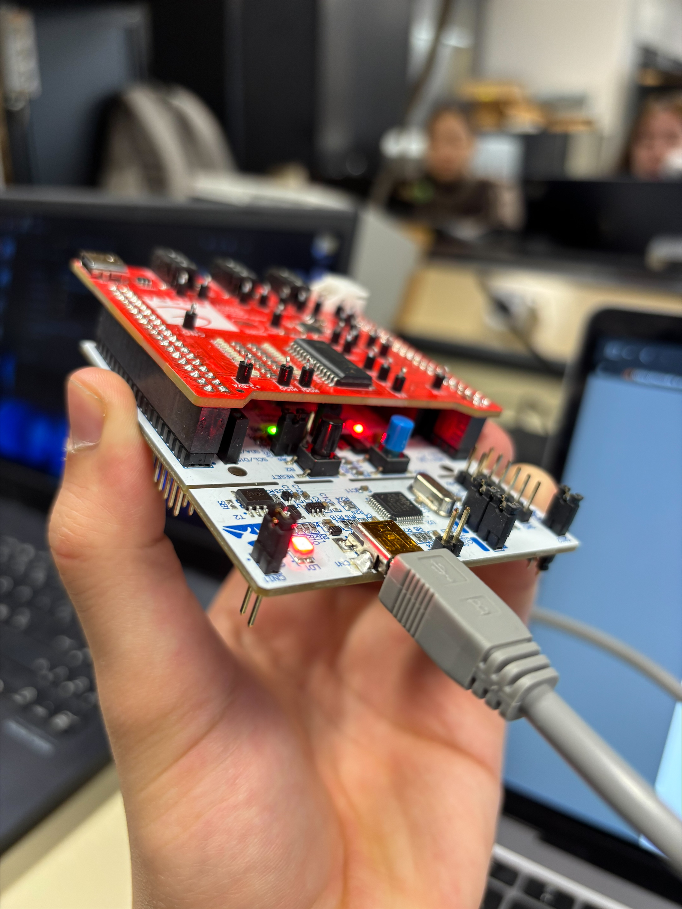
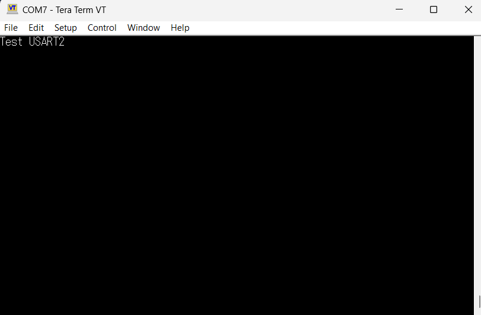
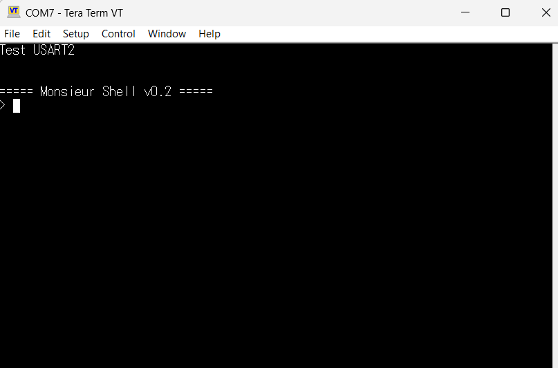
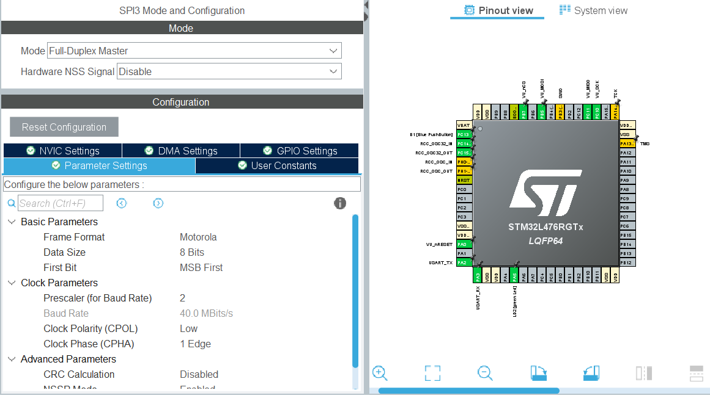
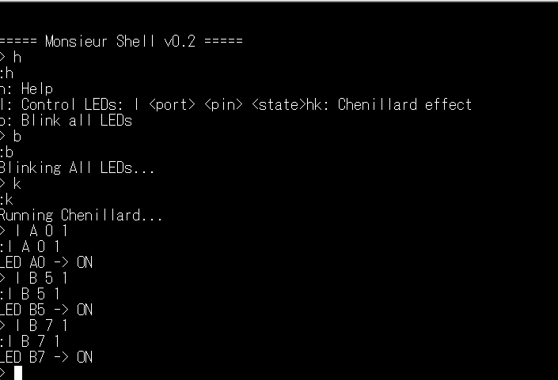
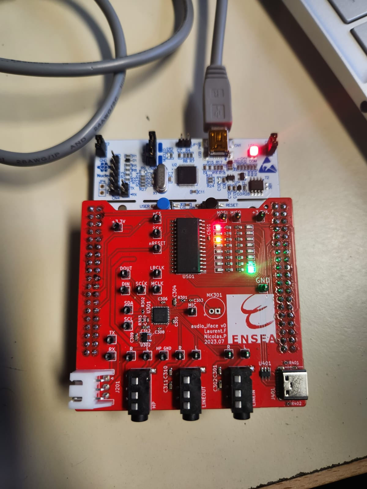

# TP_Synthèse - Autoradio 

HIMED Zineddine - SOLTANI Ezer

## Introduction

Ce projet s’inscrit dans le cadre du TP de synthèse portant sur la réalisation d’un système embarqué faisant office d’autoradio sur carte **STM32 NUCLEO-L476RG**. L’objectif est de créer une chaîne audio complète intégrant l’acquisition, le traitement et la restitution d’un signal sonore, avec une interface utilisateur via un shell ainsi qu’un affichage lumineux type VU-mètre.

Le système repose notamment sur FreeRTOS, un shell série via USART2, un GPIO Expander contrôlant un ensemble de LED via SPI, et le codec audio **SGTL5000**, configuré en I2C et utilisant le protocole I2S via SAI2 pour le flux audio. Le TP est structuré en plusieurs étapes successives, chacune validant une partie matérielle ou logicielle avant l'intégration finale.


## Objectifs

- Initialiser un projet embarqué sur STM32 avec FreeRTOS.
- Mettre en place un shell fonctionnant en tâche FreeRTOS, avec interruptions et driver structuré.
- Piloter un GPIO Expander via SPI pour contrôler un ensemble de LED servant de VU-mètre.
- Configurer le codec audio **SGTL5000** :
  - Configuration en I2C
  - Transfert audio en I2S via SAI2, horloge MCLK activée, DMA en mode circulaire
- Générer des signaux audio (ex : triangle) et les analyser à l'oscilloscope.
- Réaliser un bypass numérique ADC → DAC.
- Implémenter un filtre RC numérique sous forme d'équation par récurrence.
- Ajouter un effet audio numérique (distorsion, tremolo, delay, etc.).


## 1) Démarrage du projet

La première étape du TP consistait à créer un projet STM32 sous **STM32CubeIDE** pour la carte NUCLEO-L476RG sans activer la BSP afin de garder le contrôle sur la configuration matérielle. Après la génération du code, plusieurs vérifications ont été réalisées pour s'assurer du bon fonctionnement des périphériques de base avant d'aborder la partie audio plus complexe.

Nous avons d’abord testé la LED LD2 afin de valider l’accès au GPIO. L’allumage et le clignotement ont fonctionné comme prévu, confirmant la bonne configuration du microcontrôleur et du clocking de base : 




Nous avons ensuite configuré l’USART2, relié au ST-Link interne, afin de communiquer avec un terminal série sur PC. La transmission a été validée en envoyant des messages simples, puis nous avons redirigé la fonction `printf()` vers cette liaison afin de simplifier le débogage et l'affichage des logs durant la suite du projet. Ces premières étapes ont permis d’obtenir une interface de sortie fiable pour vérifier le fonctionnement des modules développés.



Après validation des périphériques basiques, nous avons activé **FreeRTOS en mode CMSIS-V1** afin de travailler en environnement multitâche. Cela a permis d’isoler chaque fonctionnalité (shell, audio, effets, affichage LED) dans des tâches indépendantes tout en conservant une meilleure lisibilité et modularité du code.

Une étape essentielle consistait à mettre en place un **shell accessible via UART**.



Celui-ci s’exécute dans une tâche FreeRTOS dédiée et utilise des interruptions pour la réception série. Le shell permet d’interagir dynamiquement avec le système, notamment pour tester les différents modules (GPIO Expander, codec SGTL5000, filtres, effets, etc.). Cette approche offre une meilleure flexibilité qu’un programme à comportement figé, car elle permet de modifier les paramètres en temps réel sans recompiler.

À ce stade, le système était fonctionnel avec :
- une communication série fiable,
- un shell capable de recevoir et interpréter des commandes,
- un environnement multitâche stable,
- une interface de trace via `printf()` pour le débogage.

Cette base logicielle a servi de fondation pour l’intégration des éléments audio et du pilotage des LEDs.

## 2) Le GPIO Expander et le VU‑Mètre

### 2.1 Configuration
Le GPIO Expander utilisé dans ce projet est le **MCP23S17**, un expander SPI permettant d’ajouter 16 lignes d’E/S au microcontrôleur. Sa datasheet a été consultée afin d’identifier son mode de fonctionnement, son protocole SPI ainsi que les registres nécessaires à la configuration.

L’expander est relié au microcontrôleur via le **périphérique SPI3** du STM32. Les broches utilisées sont :
- **PC10** → SCK (horloge SPI)
- **PC11** → MISO (lecture depuis le MCP23S17)
- **PC12** → MOSI (écriture vers le MCP23S17)
- Une broche GPIO libre → CS (Chip Select), configurée en sortie

La configuration du SPI3 a été réalisée directement dans STM32CubeIDE. Les paramètres visibles dans la capture ci-dessous montrent la configuration exacte utilisée pour communiquer avec le MCP23S17.



Cette configuration assure un dialogue fiable entre le STM32 et le MCP23S17. Une fois les paramètres confirmés, le code a été généré automatiquement par STM32CubeIDE.

### 2.2 Tests

La validation du fonctionnement du GPIO Expander MCP23S17 et des LED a été réalisée à l’aide de la tâche `LedTask()`. Cette tâche est chargée d’initialiser l’expander, puis de générer un chenillard sur l’ensemble des sorties, ce qui permet à la fois de faire clignoter une LED et de tester successivement toutes les lignes des ports A et B.

Le déroulement de la tâche est le suivant :

* Un **reset matériel** est d’abord appliqué au MCP23S17 via la broche `VU_nRESET` (mise à 0 puis à 1 avec un léger délai), afin de garantir un état propre du composant.
* Les deux ports du MCP23S17 sont ensuite **configurés en sortie** en écrivant `0x00` dans les registres `IODIRA` et `IODIRB` via l’interface SPI3.
* Une variable `GPIO_value` est initialisée à `0x01`. Cette valeur représente le motif binaire envoyé vers les LED.
* Dans une boucle infinie, cette valeur est écrite dans les registres de latch de sortie `OLATA` et `OLATB`, de sorte que le même motif soit appliqué sur les ports A et B.
* Un délai de 100 ms est appliqué entre chaque mise à jour, pour rendre le mouvement des LED visible.
* À chaque itération, `GPIO_value` est décalée d’un bit vers la gauche (`GPIO_value <<= 1`). Lorsque la valeur devient nulle (débordement après le bit le plus significatif), elle est réinitialisée à `0x01`.

Ce fonctionnement produit un **chenillard** : un seul bit à `1` se déplace de la position la plus faible à la plus forte, puis revient au début. Visuellement, cela se traduit par une LED allumée qui se déplace le long de la barre de LED, ce qui permet de vérifier individuellement chaque sortie de l’expander sur les ports A et B.

La tâche utilisée est la suivante :

```c
void LedTask(void *argument)
{
    // Reset
    HAL_GPIO_WritePin(VU_nRESET_GPIO_Port, VU_nRESET_Pin, GPIO_PIN_RESET);
    HAL_Delay(1);
    HAL_GPIO_WritePin(VU_nRESET_GPIO_Port, VU_nRESET_Pin, GPIO_PIN_SET);
    HAL_Delay(1);

    uint8_t tx_data[3];

    // Configurer Port A en sortie
    tx_data[0] = MCP_OPCODE_WRITE;
    tx_data[1] = MCP_IODIRA;
    tx_data[2] = 0x00; // Tous les pins en sortie
    HAL_GPIO_WritePin(VU_nCS_GPIO_Port, VU_nCS_Pin, GPIO_PIN_RESET);
    HAL_SPI_Transmit(&hspi3, tx_data, 3, HAL_MAX_DELAY);
    HAL_GPIO_WritePin(VU_nCS_GPIO_Port, VU_nCS_Pin, GPIO_PIN_SET);
    HAL_Delay(1);

    // Configurer Port B en sortie
    tx_data[1] = MCP_IODIRB;
    tx_data[2] = 0x00;
    HAL_GPIO_WritePin(VU_nCS_GPIO_Port, VU_nCS_Pin, GPIO_PIN_RESET);
    HAL_SPI_Transmit(&hspi3, tx_data, 3, HAL_MAX_DELAY);
    HAL_GPIO_WritePin(VU_nCS_GPIO_Port, VU_nCS_Pin, GPIO_PIN_SET);

    tx_data[0] = MCP_OPCODE_WRITE;

    uint8_t GPIO_value = 0x01;
    for(;;)
    {
        tx_data[2] = GPIO_value;

        // Port A
        tx_data[1] = MCP_OLATA;
        HAL_GPIO_WritePin(VU_nCS_GPIO_Port, VU_nCS_Pin, GPIO_PIN_RESET);
        HAL_SPI_Transmit(&hspi3, tx_data, 3, HAL_MAX_DELAY);
        HAL_GPIO_WritePin(VU_nCS_GPIO_Port, VU_nCS_Pin, GPIO_PIN_SET);

        // Port B
        tx_data[1] = MCP_OLATB;
        HAL_GPIO_WritePin(VU_nCS_GPIO_Port, VU_nCS_Pin, GPIO_PIN_RESET);
        HAL_SPI_Transmit(&hspi3, tx_data, 3, HAL_MAX_DELAY);
        HAL_GPIO_WritePin(VU_nCS_GPIO_Port, VU_nCS_Pin, GPIO_PIN_SET);

        HAL_Delay(100);

        GPIO_value <<= 1;
        if (GPIO_value == 0x00 ) {
            GPIO_value = 0x01;
        }
    }
}
```

```
}
```

}

### 2.3 Driver

#### Résultat des tests via le shell

La capture ci-dessous montre le fonctionnement du **driver LED** piloté depuis le shell. On y voit l’utilisation des commandes :

* `l <port> <pin> <state>` pour allumer ou éteindre une LED,
* `b` pour faire clignoter toutes les LED,
* `k` pour lancer le chenillard.



#### Résultat matériel sur la carte

La photo suivante illustre l’allumage correct des LED confirmé par les commandes envoyées depuis le shell.



Le pilotage des LED via le MCP23S17 a été encapsulé dans un **driver dédié**, permettant une organisation plus claire du code et une interaction simplifiée depuis le shell. Le driver repose sur une structure définie dans `leds.h`, regroupant les pointeurs de fonctions nécessaires : initialisation, écriture, lecture ainsi que différents modes de test des LED.

La structure principale est la suivante :

```c
typedef struct {
    void (*init)(void);
    void (*write)(uint8_t reg, uint8_t value);
    uint8_t (*read)(uint8_t reg);
    void (*test_first_led)(void);
    void (*chenillard)(void);
    void (*blink_all)(void);
} LED_Driver_t;
```

Cette approche permet de séparer clairement la logique de haut niveau de la gestion matérielle, facilitant la maintenance et l’évolution du système.

### Initialisation du driver

L’initialisation configure le MCP23S17 via SPI, place les ports en sortie (`IODIRA` et `IODIRB = 0x00`) et initialise un **shadow register** permettant de conserver localement l’état des LED.

Extrait :

```c
void LED_Driver_Init(LED_Driver_t *driver) {
    driver->init = MCP23S17_Init;
    driver->write = MCP23S17_Write;
    driver->read = MCP23S17_Read;
    driver->test_first_led = Test_First_LED;
    driver->chenillard = LED_Chenillard;
    driver->blink_all = Blink_All_LEDs;

    driver->init();
}
```

### Accès bas-niveau au MCP23S17

La communication SPI est assurée par deux fonctions privées :

* **MCP23S17_Write()** pour écrire dans un registre
* **MCP23S17_Read()** pour lire un registre

Extrait de l’écriture :

```c
static void MCP23S17_Write(uint8_t reg, uint8_t value) {
    uint8_t data[3] = { MCP_OPCODE_WRITE, reg, value };
    HAL_GPIO_WritePin(VU_nCS_GPIO_Port, VU_nCS_Pin, GPIO_PIN_RESET);
    HAL_SPI_Transmit(&hspi3, data, 3, HAL_MAX_DELAY);
    HAL_GPIO_WritePin(VU_nCS_GPIO_Port, VU_nCS_Pin, GPIO_PIN_SET);
}
```

### Commandes Shell

Afin de contrôler facilement les LED sans recompiler, plusieurs commandes shell ont été implémentées.

#### 🔹 Allumer/Éteindre une LED

Commande :

```
l <port> <pin> <state>
```

Exemple : `l A 3 1` → allume la LED A3.

Extrait :

```c
if (state == 1)
    *shadow_reg &= ~(1 << pin);   // ON (active low)
else
    *shadow_reg |=  (1 << pin);   // OFF

led_driver.write(reg_addr, *shadow_reg);
```

#### 🔹 Chenillard depuis le shell

```c
int shell_chenillard(h_shell_t *h_shell, int argc, char **argv) {
    h_shell->drv.transmit("Running Chenillard...
", 22);
    led_driver.chenillard();
    return 0;
}
```

#### 🔹 Blinking complet

```c
int shell_blink_all(h_shell_t *h_shell, int argc, char **argv) {
    h_shell->drv.transmit("Blinking All LEDs...
", 23);
    led_driver.blink_all();
    return 0;
}
```

L’intégration de ce driver et de ses commandes shell permet un pilotage complet et flexible du VU-mètre, tout en gardant une architecture logicielle propre et modulaire.

## 3. Le CODEC Audio SGTL5000

### 3.1 Configuration préalables

Le codec **SGTL5000** nécessite deux interfaces distinctes pour fonctionner correctement :

* **I2C** pour la configuration (accès aux registres internes),
* **SAI2 [Serial Audi Interface] (I2S)** pour l’échange des données audio (échantillons PCM).

La configuration a été entièrement réalisée sous **STM32CubeIDE**, conformément aux consignes du TP.

---

### 🔹 Configuration de l’horloge — PLLSAI1 pour générer 12.235294 MHz

Le SGTL5000 requiert une horloge audio stable. Pour cela, le périphérique **SAI2** est alimenté par **PLLSAI1**, configurée pour produire **12.235294 MHz**.

Voici la configuration obtenue :


Cette fréquence correspond à un multiple compatible avec l’audio 48 kHz (conditions du TP).

---

### 🔹 Configuration du SAI2

Le SAI2 est composé de deux sous-blocs :

* **SAI2_A** : configuré en *Master Transmit* avec génération du **Master Clock (MCLK)**.
* **SAI2_B** : configuré en *Synchronous Slave* (suivant la clock de A).

Les deux utilisent le mode **I2S/PCM Protocol**.


Les broches utilisées sont :

* **PB12** → SAI2_FS_A
* **PB13** → SAI2_SCK_A
* **PB14** → SAI2_MCLK_A
* **PB15** → SAI2_SD_A
* **PC12** → SAI2_SD_B

Ces broches correspondent au schéma fourni dans le sujet.

---

### 🔹 Configuration de l’I2C (pour piloter le SGTL5000)

L’I2C utilisé est **I2C2**, configuré en mode Standard (100 kHz), ce qui est suffisant pour écrire dans les registres du SGTL5000.


Les broches associées sont :

* **PB10** → I2C2_SCL
* **PB11** → I2C2_SDA

La configuration reste celle par défaut, comme demandé dans le TP.

---

### 🔹 Configuration du DMA pour le SAI2

Pour gérer efficacement le flux audio via le SAI2, le **DMA (Direct Memory Access)** a été configuré pour les sous-blocs SAI2_A et SAI2_B. Le mode circulaire est activé pour permettre un transfert continu des données sans intervention du processeur.

*   **SAI2_A** : Utilise **DMA1 Channel 6** avec une direction *Memory To Peripheral*. Cela permet de transmettre les données audio depuis la mémoire vers le DAC du CODEC. La priorité est réglée sur *Low*.
*   **SAI2_B** : Utilise **DMA1 Channel 7** avec une direction *Peripheral To Memory*. Cela permet de recevoir les données audio depuis l'ADC du CODEC et de les stocker en mémoire. La priorité est également réglée sur *Low*.

Ces configurations sont visibles dans la capture d'écran ci-dessous :


---

### 🔹 Activation du Master Clock (MCLK)

Avant de poursuivre, il est crucial d'activer l'horloge Master Clock (MCLK) pour le CODEC SGTL5000 afin d'assurer son bon fonctionnement. Cette activation se fait programmatiquement dans la fonction `main()`, juste après les initialisations des périphériques.

La ligne de code suivante est ajoutée :

```c
  /* Initialize all configured peripherals */
  MX_GPIO_Init();
  MX_DMA_Init();
  MX_USART2_UART_Init();
  MX_SPI3_Init();
  MX_I2C2_Init();
  MX_SAI2_Init();
  /* USER CODE BEGIN 2 */
HAL_SAI_ENABLE(&hsai_BlockA2);
```

## 3.2 Configuration du CODEC par l’I2C

Le CODEC SGTL5000 est piloté via l'interface I2C pour sa configuration interne (volumes, routage, horloges, etc.). Une bibliothèque dédiée composée des fichiers `sgtl5000.c` et `sgtl5000.h` a été développée pour encapsuler ces échanges.

### Lecture du CHIP_ID

La première étape de validation consiste à lire le registre d'identification du composant. L'adresse I2C de base est `0x0A` (7 bits), ce qui correspond à `0x14` en écriture et `0x15` en lecture.

Dans la fonction d'initialisation, nous lisons le registre `CHIP_ID` (0x0000) :

uint16_t chip_id_value;
sgtl5000_i2c_read_register(h_sgtl5000, SGTL5000_CHIP_ID, &chip_id_value);
// La valeur attendue est typiquement 0xA000


### Configuration des registres

Pour configurer le CODEC selon les spécifications du TP (Fréquence d'échantillonnage de 48 kHz, interface I2S en mode esclave, etc.), les valeurs suivantes ont été déterminées et écrites dans les registres :

| Registre | Valeur Hex | Description |
| :--- | :--- | :--- |
| `CHIP_ANA_POWER` | `0x6AFF` | Active les blocs analogiques (DAC, ADC, PLL, Sorties Ligne/Casque) |
| `CHIP_LINREG_CTRL` | Bits 5,6 à 1 | Configure la pompe de charge pour une tension VDDIO > 3.1V |
| `CHIP_REF_CTRL` | `0x01FF` | Définit la tension de référence (VAG = 1.575V) |
| `CHIP_LINE_OUT_CTRL` | `0x031E` | Configure le niveau et le courant de bias de la sortie ligne |
| `CHIP_SHORT_CTRL` | `0x1106` | Active la protection contre les courts-circuits |
| `CHIP_ANA_CTRL` | `0x0004` | Sélectionne l'entrée ADC (Line-In) |
| `CHIP_DIG_POWER` | `0x0073` | Active les blocs numériques (I2S In/Out, DAC, ADC) |
| `CHIP_CLK_CTRL` | `0x0004` | Définit la fréquence d'échantillonnage (Sys_FS) à 48 kHz |
| `CHIP_I2S_CTRL` | `0x0130` | Mode I2S Esclave, longueur de donnée 16 bits |
| `CHIP_ADCDAC_CTRL` | `0x0000` | Désactive le mute du DAC |
| `CHIP_DAC_VOL` | `0x3C3C` | Règle le volume du DAC à 0dB (droite et gauche) |

### Implémentation logicielle

#### Initialisation dans `sgtl5000.c`

Voici l'extrait de la fonction `sgtl5000_init` qui applique cette configuration :

```c
HAL_StatusTypeDef sgtl5000_init(h_sgtl5000_t *h_sgtl5000) {
    HAL_StatusTypeDef ret = HAL_OK;
    uint16_t chip_id_value;

    // 1. Vérification de la communication
    ret = sgtl5000_i2c_read_register(h_sgtl5000, SGTL5000_CHIP_ID, &chip_id_value);
    if (ret != HAL_OK) return ret;

    // 2. Configuration de l'alimentation et des références
    ret |= sgtl5000_i2c_write_register(h_sgtl5000, SGTL5000_CHIP_ANA_POWER, 0x6AFF);
    ret |= sgtl5000_i2c_set_bit(h_sgtl5000, SGTL5000_CHIP_LINREG_CTRL, (1 << 5) | (1 << 6));
    ret |= sgtl5000_i2c_write_register(h_sgtl5000, SGTL5000_CHIP_REF_CTRL, 0x01FF);
    ret |= sgtl5000_i2c_write_register(h_sgtl5000, SGTL5000_CHIP_LINE_OUT_CTRL, 0x031E);
    ret |= sgtl5000_i2c_write_register(h_sgtl5000, SGTL5000_CHIP_SHORT_CTRL, 0x1106);
    ret |= sgtl5000_i2c_write_register(h_sgtl5000, SGTL5000_CHIP_ANA_CTRL, 0x0004); // ADC Input = Line In
    ret |= sgtl5000_i2c_write_register(h_sgtl5000, SGTL5000_CHIP_DIG_POWER, 0x0073);

    // 3. Configuration de l'horloge et de l'interface I2S
    ret |= sgtl5000_i2c_write_register(h_sgtl5000, SGTL5000_CHIP_CLK_CTRL, 0x0004); // 48 kHz
    ret |= sgtl5000_i2c_write_register(h_sgtl5000, SGTL5000_CHIP_I2S_CTRL, 0x0130); // Slave, 16-bit;

    // 4. Routage et Volumes
    ret |= sgtl5000_i2c_write_register(h_sgtl5000, SGTL5000_CHIP_ADCDAC_CTRL, 0x0000);
    ret |= sgtl5000_i2c_write_register(h_sgtl5000, SGTL5000_CHIP_DAC_VOL, 0x3C3C); // 0dB

    return ret;
}
```

#### Appel dans `main.c`

Dans le fichier `main.c`, la structure de gestion est initialisée et la fonction est appelée après l'activation du MCLK :

```c
// Initialisation de la structure avec le pointeur I2C et l'adresse
sgtl5000_handle.hi2c = &hi2c2;
sgtl5000_handle.i2c_address = SGTL5000_I2C_ADDR_WRITE;

// Configuration effective du CODEC
sgtl5000_init(&sgtl5000_handle);
```
```

